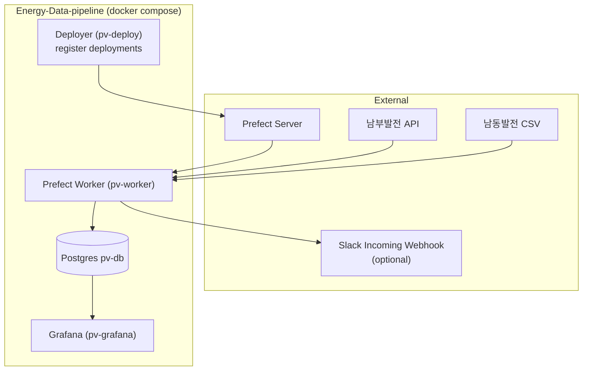

# Architecture

이 문서는 `README.md`의 내용을 보완하는 **아키텍처 상세**입니다. 실행 방법/환경변수/스케줄은 `README.md`를 기준으로 보세요.

## 네트워크 토폴로지

이 저장소의 `docker-compose.yml`은 Prefect Server를 포함하지 않습니다.

- PV 파이프라인 컨테이너들은 **외부 Prefect 네트워크**(`prefect-network`)에 붙어서 Prefect Server와 통신합니다.
- `docker-compose.yml`의 기본값은 아래처럼 외부 네트워크를 참조합니다.
  - `prefect-network.name = weather-pipeline_prefect-new`

Prefect Server가 다른 네트워크에 떠 있다면, `docker-compose.yml`의 `prefect-network.name`을 Prefect Server가 붙어있는 네트워크명으로 바꿔야 합니다.

## 컴포넌트

## 운영 원칙

- **Deployment 등록**: `pv-deploy`가 `prefect_flows/deploy.py`를 1회 실행해 deployment/schedule을 등록합니다.
- **실행**: Prefect Server가 스케줄 트리거를 생성하고, `pv-worker`가 `pv-pool`에서 잡을 받아 실행합니다.
- **데이터 적재**: PV 데이터는 Postgres(`pv-db`)에 저장됩니다.
- **백필**: 남부발전 2026~ 데이터는 `fetch_data/pv/nambu_backfill.py`로 원하는 기간을 수동 백필합니다.

