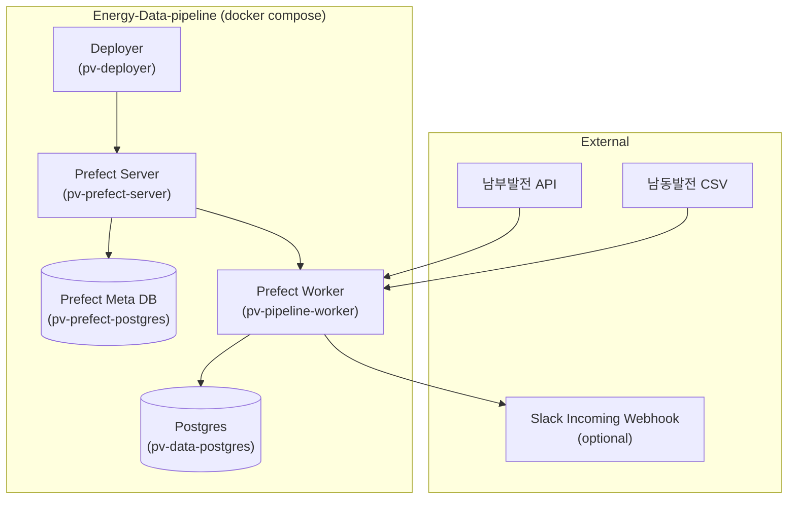

# Architecture

이 문서는 `README.md`의 내용을 보완하는 **아키텍처 상세**입니다. 실행 방법/환경변수/스케줄은 `README.md`를 기준으로 보세요.

## 네트워크 토폴로지

운영 compose 는 `docker/docker-compose.yml` 하나이며 Prefect Server 를 포함한다.
과거 루트 `docker-compose.yml`(외부 Prefect 네트워크 참조)은 2026-08 에 제거했다.

## 컴포넌트

```mermaid
flowchart TB
  subgraph Ext[External]
    Slack["Slack Incoming Webhook\n(optional)"]
    NambuAPI["남부발전 API"]
    NamdongCSV["남동발전 CSV"]
  end

  subgraph Stack["Energy-Data-pipeline (docker compose)"]
    PrefectServer["Prefect Server\n(pv-prefect-server)"]
    PrefectDB[("Prefect Meta DB\n(pv-prefect-postgres)")]
    DataDB[("Postgres\n(pv-data-postgres)")]
    Worker["Prefect Worker\n(pv-pipeline-worker)"]
    Deploy["Deployer\n(pv-deployer)"]
  end

  Deploy --> PrefectServer
  PrefectServer --> PrefectDB
  PrefectServer --> Worker
  Worker --> DataDB
  NambuAPI --> Worker
  NamdongCSV --> Worker
  Worker --> Slack
```

## 운영 원칙

- **Deployment 등록**: `pv-deploy`가 `prefect_flows/deploy.py`를 1회 실행해 deployment/schedule을 등록합니다.
- **실행**: Prefect Server가 스케줄 트리거를 생성하고, `pv-worker`가 `pv-pool`에서 잡을 받아 실행합니다.
- **데이터 적재**: PV 데이터는 Postgres(`pv-db`)에 저장됩니다.
- **백필**: 남부발전 2026~ 데이터는 `fetch_data/pv/nambu_backfill.py`로 원하는 기간을 수동 백필합니다.

