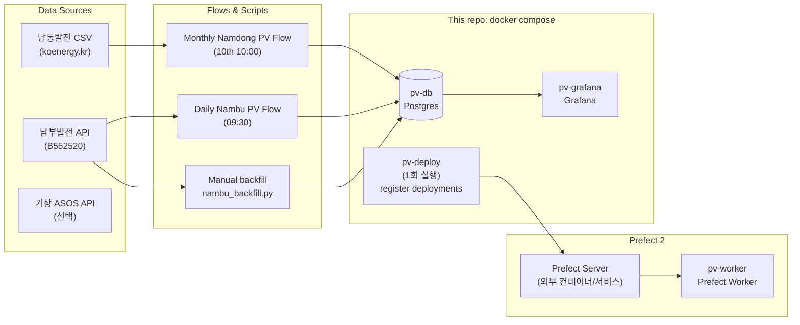
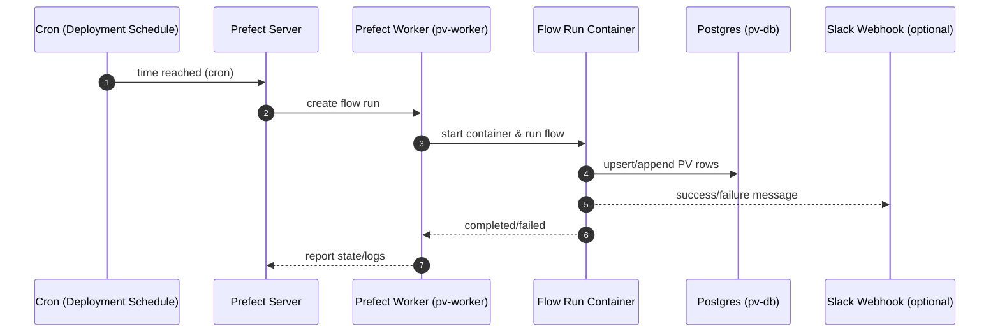

# Energy-Data-pipeline

남부발전/남동발전 태양광(PV) 발전 데이터 및 기상 데이터를 수집, 전처리하여 PostgreSQL에 저장하고 Grafana 지도 시각화를 제공하는 파이프라인입니다.

## 시스템 아키텍처

```
┌─────────────────────────────────────────────────────────────────────────────┐
│                              Docker Compose                                  │
├─────────────────────────────────────────────────────────────────────────────┤
│                                                                              │
│  ┌──────────────────┐     ┌──────────────────┐     ┌──────────────────┐     │
│  │ prefect-postgres │     │   pv-postgres    │     │    pv-grafana    │     │
│  │    -new          │     │                  │     │                  │     │
│  │  ───────────────│     │  ───────────────│     │  ───────────────│     │
│  │  Prefect 메타DB  │     │  PV/기상 데이터  │     │  시각화 대시보드  │     │
│  │  :5432 (내부)    │     │  :5434 (외부)    │     │  :3003 (외부)    │     │
│  └────────┬─────────┘     └────────┬─────────┘     └────────┬─────────┘     │
│           │                        │                        │               │
│           │                        │                        │               │
│  ┌────────▼─────────┐              │                        │               │
│  │ prefect-server   │              │                        │               │
│  │    -new          │◄─────────────┼────────────────────────┘               │
│  │  ───────────────│              │                                        │
│  │  오케스트레이션   │              │                                        │
│  │  :4300 (외부)    │              │                                        │
│  └────────┬─────────┘              │                                        │
│           │                        │                                        │
│     ┌─────┴─────┐                  │                                        │
│     │           │                  │                                        │
│  ┌──▼───┐  ┌────▼────┐             │                                        │
│  │ pv-  │  │  pv-    │             │                                        │
│  │deploy│  │ worker  │─────────────┘                                        │
│  │ -er  │  │         │                                                      │
│  │ ─────│  │ ────────│                                                      │
│  │1회   │  │플로우    │                                                      │
│  │배포  │  │실행      │                                                      │
│  └──────┘  └─────────┘                                                      │
│                                                                              │
└─────────────────────────────────────────────────────────────────────────────┘
```

## Docker 컨테이너 상세

| 컨테이너 | 이미지 | 포트 | 역할 |
|---------|--------|------|------|
| **prefect-postgres-new** | postgres:14 | 내부 5432 | Prefect 서버 메타데이터 저장 (플로우 상태, 스케줄, 로그) |
| **pv-postgres** | postgres:14 | 5434:5432 | PV 발전량, 기상 데이터 저장용 메인 DB |
| **pv-grafana** | grafana/grafana | 3003:3000 | 데이터 시각화 대시보드 (지도, 시계열 차트) |
| **prefect-server-new** | prefecthq/prefect:2 | 4300:4200 | Prefect 오케스트레이션 서버 (스케줄링, 모니터링 UI) |
| **pv-deployer** | pv-pipeline:latest | - | 플로우 배포 (시작 시 1회 실행 후 종료) |
| **pv-worker** | prefecthq/prefect:2 | - | Docker Worker - 스케줄된 플로우 실제 실행 |

## 데이터 흐름

### 1. 기상 데이터 (Weather)
```
기상청 ASOS API → collect_asos.py → CSV → PostgreSQL (pv-postgres)
                        ↓
              daily-weather-collection-flow (매일 09:00)
```

### 2. 남부발전 PV 데이터
```
남부발전 API → nambu_bulk_sync.py → pv_data_raw/ → nambu_merge_pv_data.py
                                                            ↓
                                              pv_data_processed/ → PostgreSQL
```

### 3. 남동발전 PV 데이터
```
남동발전 CSV → namdong_collect_pv.py → pv_data_raw/ → namdong_merge_pv_data.py
                                                            ↓
                                                  pv_data/ (NAS) → PostgreSQL
```

## 프로젝트 구조

```
Energy-Data-pipeline/
├── docker/
│   ├── docker-compose.yml       # 메인 Docker 구성
│   ├── Dockerfile               # pv-pipeline 이미지 빌드
│   └── grafana/
│       ├── provisioning/        # Grafana 자동 설정
│       │   ├── datasources/     # PostgreSQL 연결
│       │   └── dashboards/      # 대시보드 프로비저닝
│       └── dashboards/          # JSON 대시보드 파일
│
├── fetch_data/
│   ├── common/                  # 공통 유틸리티
│   │   └── impute_missing.py    # 결측치 처리
│   ├── weather/                 # 기상 데이터 수집
│   │   └── collect_asos.py      # ASOS API 수집
│   └── pv/                      # PV 데이터 수집
│       ├── nambu_probe_date.py      # 남부발전 시작일 탐색
│       ├── nambu_bulk_sync.py       # 남부발전 일괄 수집
│       ├── nambu_merge_pv_data.py   # 남부발전 전처리
│       ├── daily_pv_automation.py   # 일별 자동화
│       ├── namdong_collect_pv.py    # 남동발전 CSV 수집
│       ├── namdong_merge_pv_data.py # 남동발전 전처리
│       └── database.py              # PV DB 모델
│
├── prefect_flows/
│   ├── deploy.py                # 플로우 배포 스크립트
│   ├── prefect_pipeline.py      # 메인 플로우 정의
│   └── merge_to_all.py          # CSV 병합 유틸
│
├── pv_data/                     # 남동발전 데이터 (NAS mount)
├── pv_data_raw/                 # 원본 수집 데이터
├── pv_data_processed/           # 전처리된 데이터
│
├── initial_db_ingestion.py      # DB 초기 적재
├── .env                         # 환경변수 (API 키 등)
├── ARCHITECTURE.md              # 상세 아키텍처 문서
└── README.md
```

## 환경 변수 설정

`.env` 파일:
```bash
docker compose up -d --build
```

실행 시 동작:
- `pv-db`, `pv-grafana`, `pv-worker`가 상시 실행됩니다.
- `pv-deploy`가 1회 실행되어 Prefect에 deployment/schedule을 등록한 뒤 종료됩니다.

## 서비스 & 포트

| 구성요소 | 컨테이너 | 기본 포트 | 비고 |
|---|---|---:|---|
| Postgres | `pv-main-db` | `5432` | PV 데이터 저장소 |
| Grafana | `pv-main-grafana` | `3002` | `http://localhost:3002` |
| Prefect Worker | `pv-worker` | - | Prefect work pool(`pv-pool`) 구독 |
| Deployer(1회) | `pv-deploy` | - | `prefect_flows/deploy.py` 실행 |

## 아키텍처 (Mermaid)

### 전체 구성


### 스케줄 실행 흐름


## 데이터 모델(핵심 테이블)
현재 수집/적재 스크립트 기준으로 아래 테이블을 사용합니다.

- `nambu_generation`: 남부발전 시간별 발전량(24행/일 목표)
  - 주요 컬럼: `datetime`, `gencd`, `hogi`, `plant_name`, `generation`, `daily_total`, `daily_avg`, `daily_max`, `daily_min`
- `namdong_generation`: 남동발전 시간별 발전량(스키마는 환경에 따라 다를 수 있음)
- `nambu_plants`, `namdong_plants`: 발전소 메타(선택/환경에 따라)

## Prefect Flows & 스케줄

Prefect deployment 등록은 `pv-deploy`가 수행합니다.
- 등록 스크립트: `prefect_flows/deploy.py`

등록되는 주요 deployment(기본):
- `daily-weather-collection` (09:00, KST) — 기상 CSV 수집 (옵션)
- `daily-nambu-pv-collection` (09:30, KST) — 남부발전 PV 적재 + Slack 알림
- `monthly-namdong-pv-collection` (매월 10일 10:00, KST) — 전월 남동발전 PV 적재 + Slack 알림
- `full-etl` — 수동 실행(필요 시)

## 수동 백필 (남부발전 2026~)

`nambu_generation`에 “원하는 기간”을 백필하려면:
```bash
uv run python fetch_data/pv/nambu_backfill.py \
  --db-url "postgresql+psycopg2://<DB_USER>:<DB_PASS>@localhost:5432/<DB_NAME>"
```

### Grafana(3006)에서 바로 보이게 백필하기
현재 `http://localhost:3006`의 Grafana는 별도 스택(`docker/docker-compose.yml`)의 DB(`pv-data-postgres`, `localhost:5436`, `pv/pv`)를 기본 데이터소스로 사용합니다.

그래서 Grafana(3006) 대시보드에서 “No data”가 뜬다면, 아래처럼 **Grafana가 바라보는 DB로 백필**해야 즉시 반영됩니다.
```bash
uv run python fetch_data/pv/nambu_backfill.py \
  --db-url "postgresql+psycopg2://pv:pv@localhost:5436/pv"
```

옵션:
- `--start`, `--end`: 없으면 실행 중 입력으로 받음
- `--gencd`, `--hogi`: 특정 발전소/호기만
- `--slack`: Slack 알림 전송
- `--debug`: API 응답/코드 출력

## 트러블슈팅

### 1) `pv-db` 도커 DNS(`pv-db`)를 호스트에서 못 찾음
호스트에서 스크립트를 실행할 땐 `--db-url`을 `localhost:<port>`로 지정하세요.

### 2) 남부발전 API 인증 실패(401)
`NAMBU_API_KEY`가 URL-encoded 형태로 제공되는 경우가 있어서, 본 스크립트는 **encoded 키도 그대로 요청에 넣는 모드**를 지원합니다. 브라우저에서 동작하는 URL을 기준으로 `.env` 값을 맞추세요.

### 3) Prefect 배포는 되었는데 실행이 안 됨
- Prefect Server가 실제로 실행 중인지 확인 (`PREFECT_API_URL`)
- Worker가 `pv-pool`을 구독하고 있는지 확인: `docker logs -f pv-worker`
