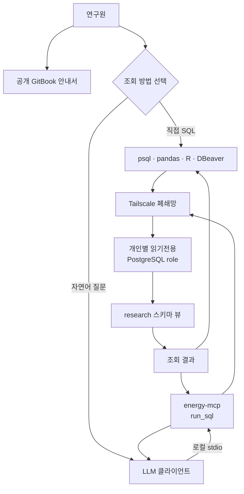

# 데이터 제공 구조

직접 SQL과 LLM·MCP가 어디에서 갈라지고, 어디에서 다시 같은 보안 경계를 사용하는지 설명합니다.

## 한눈에 보는 전체 흐름

- 네트워크: Tailscale 밖에서는 PostgreSQL에 연결할 수 없습니다.
- 권한: 운영 테이블은 숨기고 `research` 스키마 뷰만 `SELECT`를 허용합니다.
- 식별: 연구원마다 서로 다른 PostgreSQL role(DB 계정)을 사용합니다.
- 감사: 누가 어떤 SQL을 실행했는지 DB 로그에 기록됩니다.

## 최초 1회 준비

1. [이용조건](05-terms.md)을 읽고 서약합니다.
2. 관리자의 초대로 Tailscale에 가입하고 로그인합니다.
3. 개인별 읽기전용 DB 계정(role·비밀번호)을 별도 채널로 받습니다.

이후에는 선택한 조회 방법의 가이드만 따라 하면 됩니다.

## 방법 1: 직접 SQL

psql·pandas·R·DBeaver 같은 익숙한 도구로 PostgreSQL에 직접 연결합니다.
쿼리를 연구원이 직접 작성하므로 재현 가능한 분석에 적합합니다.

1. Tailscale에 연결된 상태에서 개인 계정으로 DB에 접속
2. `research` 스키마의 뷰를 SQL로 조회
3. 결과를 분석 환경(pandas·R 등)에서 바로 사용

→ [직접 SQL로 조회](02-direct-sql.md)

## 방법 2: LLM·MCP

`energy-mcp`(연구원 PC에서 실행되는 로컬 MCP 서버)를 LLM 클라이언트에
등록하면 자연어로 질문할 수 있습니다. LLM이 SQL을 생성하고 `energy-mcp`가
같은 개인 계정으로 실행합니다.

1. Tailscale에 연결된 상태에서 로컬 `energy-mcp` 실행
2. LLM 클라이언트가 stdio(표준 입출력)로 `energy-mcp`에 SQL 실행을 요청
3. 실행된 SQL과 결과를 연구원이 직접 검증

→ [LLM·MCP로 조회](03-llm-mcp.md)

## 두 방법에 공통인 보호 장치

| 보호 장치 | 내용 |
|---|---|
| Tailscale 폐쇄망 | 폐쇄망 밖에서는 DB에 아예 연결할 수 없음 |
| 개인별 읽기전용 role | `research` 스키마 `SELECT` 권한만 부여, 운영 테이블 접근 불가 |
| 쿼리 시간 제한 | `statement_timeout` 60초 — 오래 걸리는 쿼리는 자동 종료 |
| 감사 로그 | 모든 쿼리가 role별로 DB 로그에 기록 |

LLM·MCP 방식이라고 해서 별도의 공개 서버를 거치지 않습니다. `energy-mcp`는
연구원 PC 안에서만 돌고, DB 연결은 직접 SQL과 완전히 같은 경로를 씁니다.

## GitBook에 공개하지 않는 정보

실제 DB 호스트 주소, 비밀번호, Tailscale 초대 링크, 개인별 완성 DSN(접속
문자열)은 이 공개 문서에 싣지 않으며 관리자가 별도 채널로 전달합니다.
문서의 `<발급받은_ID>` 같은 플레이스홀더를 실제 값으로 바꿔 쓰되, 그 값을
문서·저장소·채팅에 남기지 마세요.
