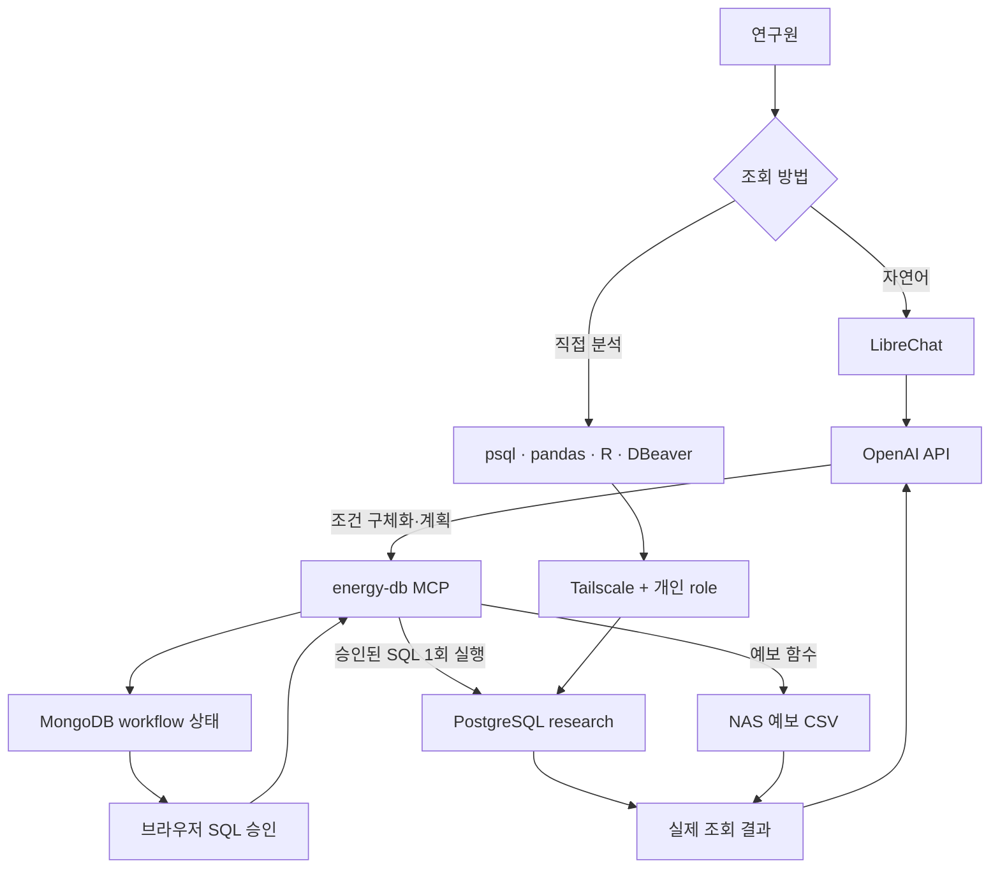

# 데이터 제공 구조

연구 데이터는 PostgreSQL `research` 스키마와 NAS에 보관합니다. 데이터 조회는
연구원이 개인 계정으로 직접 SQL을 실행하거나, 호스팅 LibreChat에서 조건과 SQL을
확인하고 승인한 뒤 실행하는 방식으로 제공합니다.

## 한눈에 보는 흐름

```mermaid
flowchart TB
    U[연구원] --> C{조회 방법}
    C -->|자연어| L[LibreChat]
    C -->|직접 분석| D[psql · pandas · R · DBeaver]
    L --> O[OpenAI API]
    O -->|조건 구체화·계획| M[energy-db MCP]
    M --> W[MongoDB workflow 상태]
    W --> A[브라우저 SQL 승인]
    A --> M
    M -->|승인된 SQL 1회 실행| P[PostgreSQL research]
    M -->|예보 함수| N[NAS 예보 CSV]
    P --> R[실제 조회 결과]
    N --> R
    R --> O
    D --> T[Tailscale + 개인 role]
    T --> P
```

## 경로별 경계

| 경로 | 로그인·네트워크 | PostgreSQL 신원 | 실행 방식 |
| --- | --- | --- | --- |
| LibreChat 자연어 조회 | LibreChat 계정. 접속 주소에 따라 Tailscale 연결 필요 | 공용 읽기전용 `demo_ro` | 계획 결과를 브라우저에서 승인한 뒤 1회 실행 |
| 직접 SQL | Tailscale 폐쇄망과 개인별 DB 계정 | 개인별 읽기전용 role | 연구원이 SQL을 작성·실행 |

LibreChat에서는 질문에 필요한 대화 문맥과 조회 결과가 OpenAI API로 전송됩니다.
서버 측 MCP가 공용 `demo_ro`로 조회하므로 PostgreSQL 감사 기록에도 이 공용 계정이
남습니다. 직접 SQL 경로의 개인 role과 같은 인증·감사 경계가 아닙니다.

## LibreChat 승인 workflow

사용자가 MCP 도구 메뉴에서 `energy-db`를 켜고 질문하면 `plan_query`가 조건을
정리합니다. 필요한 정보가 빠졌으면 `needs_clarification` 질문으로 지역·기간·요소·
집계 등을 확인합니다. 계획이 완성되면 조건, SQL, 승인 링크를 제시합니다. SQL은
브라우저 승인 뒤 사용자가 채팅에 돌아와 승인했다고 알린 후 실행됩니다. `execute_query`는
MongoDB에 저장된 승인 SQL을 한 번만 점유해 실행하고 결과와 CSV 링크를 돌려줍니다.

질문·답변·조건·SQL·상태는 workflow에 저장되며 30분 뒤 실행에 사용할 수 없게
됩니다. MongoDB TTL에 의한 물리 삭제는 비동기입니다. 조회 행과 CSV 내용은 workflow
문서에 저장하지 않습니다. CSV 보존은 별도 24시간 정리 동작을 따릅니다. 상세 범위는
[LLM·MCP 데이터 처리와 투명성](06-llm-transparency.md)을 참고하세요.

## 직접 SQL과 운영 데이터

직접 SQL은 Tailscale을 통해 개인별 읽기전용 계정으로 접속합니다. 설정과 예시는
[직접 SQL로 조회](02-direct-sql.md)를 참고하세요. 호스팅 LibreChat에는 개인 DB
비밀번호를 입력하지 않습니다.

예보 시계열은 PostgreSQL 테이블에 적재되지 않고 NAS CSV를 조회 함수로 읽습니다.
지역 목록 CSV는 어떤 읍면동 이름이 준비되어 있는지 알려주며, 실제 시계열 CSV는
예보 값을 담습니다. 지역 목록에 있더라도 요청한 기간에 값이 없을 수 있습니다.

## 접속 정보

LibreChat 주소와 계정, Tailscale 접속 필요 여부는 관리자가 별도로 안내합니다.
공개 GitBook에는 실제 호스트 주소, 계정, 비밀번호, 초대 링크, 완성 DSN을 싣지
않습니다.
