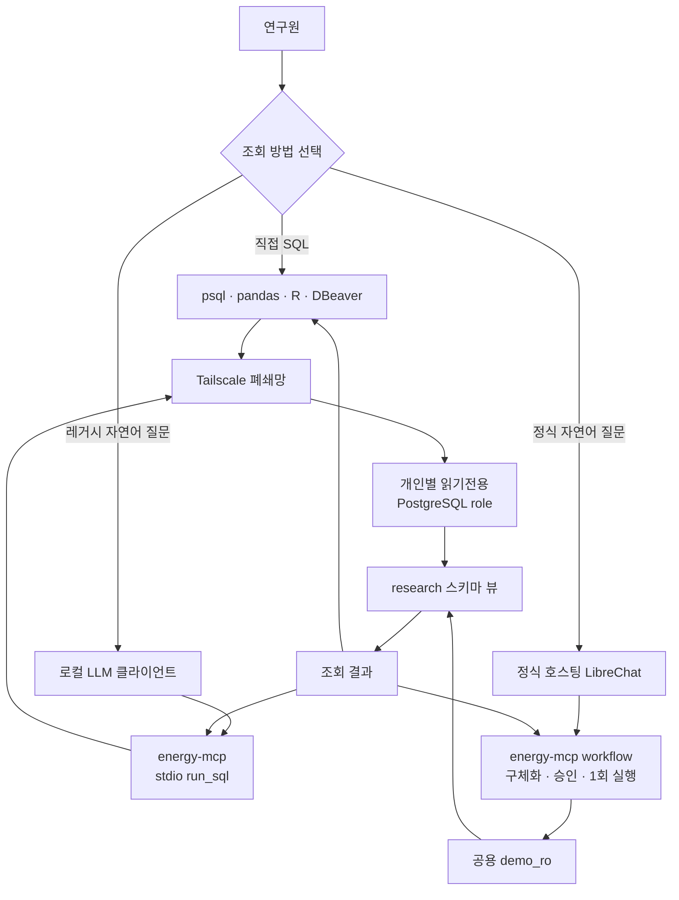

# 데이터 제공 구조

직접 SQL, 정식 호스팅 LLM·MCP, 레거시 로컬 stdio는 같은 `research` 스키마를
읽지만 접속·신원·승인 경계가 다릅니다.

## 한눈에 보는 전체 흐름

```mermaid
flowchart TB
    U[연구원] --> C{조회 방법 선택}

    C -->|직접 SQL| D[psql · pandas · R · DBeaver]
    C -->|정식 자연어 질문| L[정식 호스팅 LibreChat]
    C -->|레거시 자연어 질문| X[로컬 LLM 클라이언트]

    D --> T[Tailscale 폐쇄망]
    X --> M["energy-mcp<br/>stdio run_sql"]
    M --> T
    T --> P["개인별 읽기전용<br/>PostgreSQL role"]

    L --> W["energy-mcp workflow<br/>구체화 · 승인 · 1회 실행"]
    W --> G[공용 demo_ro]

    P --> V[research 스키마 뷰]
    G --> V
    V --> R[조회 결과]
    R --> D
    R --> M
    R --> W
```

## 경로별 경계

| 경로 | 네트워크·로그인 | PostgreSQL 신원 | 실행 통제 |
| --- | --- | --- | --- |
| 직접 SQL | Tailscale 폐쇄망 | 개인별 읽기전용 role | 연구원이 SQL을 직접 실행 |
| 정식 호스팅 LibreChat | LibreChat 계정 로그인 | 공용 읽기전용 `demo_ro` | 서버가 저장한 조건·SQL을 웹에서 승인한 뒤 1회 실행 |
| 레거시 로컬 stdio | Tailscale 폐쇄망 | 개인별 읽기전용 role | `run_sql`이 즉시 실행하므로 고급·비권장 |

모든 DB 연결은 읽기전용 세션이고 운영 테이블 대신 `research` 스키마만 조회합니다.
쿼리에는 60초 `statement_timeout`이 적용됩니다. 다만 정식 호스팅 경로의 DB
감사 로그에는 개인이 아니라 공용 `demo_ro`가 남으므로 개인별 role 경로와 같다고
간주하면 안 됩니다.

## 정식 승인 workflow

정식 호스팅 경로는 질문과 답변, 정규화된 조건, SQL 및 SHA-256을 MongoDB에
30분 동안 보존합니다. 승인 페이지는 SQL을 실행하지 않으며, 일회용 CSRF와
승인 당시 SQL hash가 일치해야 `confirmed`가 됩니다. `execute_query`는 승인된
저장 SQL을 한 번만 점유하고 실행합니다. 결과 행과 CSV는 MongoDB에 저장하지
않습니다.

현재 workflow의 `conversation_id`와 `principal_id`는 비어 있습니다. Tailscale
IP 허용 목록과 IP→`principal` 매핑은 이번 정식 서비스 범위에서 제외된 후속
경계입니다. 그 전까지 LibreChat 로그인은 유지되지만, 승인 링크를 가진 사람과
채팅 사용자가 같은 주체인지 서버가 결합해 증명하지는 않습니다. 승인 URL을
전달하거나 공유하지 마세요.

## 준비 사항

- 정식 호스팅 LLM·MCP: 이용조건 서약 후 관리자에게 LibreChat 주소와 계정을
  받습니다. 개인 DB 비밀번호를 LibreChat에 입력하지 않습니다.
- 직접 SQL·레거시 로컬 stdio: Tailscale에 가입하고 개인별 읽기전용 DB 계정을
  별도 채널로 받습니다.

## GitBook에 공개하지 않는 정보

실제 DB 호스트 주소, 비밀번호, Tailscale 초대 링크, 개인별 완성 DSN은 공개
문서에 싣지 않습니다. 문서의 플레이스홀더를 실제 값으로 바꾸더라도 그 값을
문서·저장소·채팅에 남기지 마세요.
