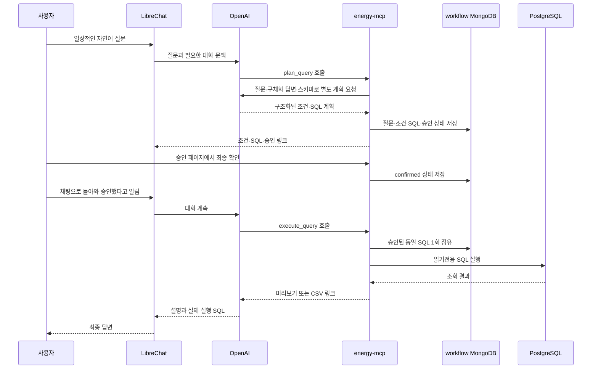

# LLM·MCP 데이터 처리와 투명성

자연어 질문이 어디로 전송되고 무엇이 저장되는지 설명합니다. 이 페이지에서
`MongoDB`는 원본 연구 데이터 저장소가 아니라 LibreChat과 MCP의 상태 저장소를
뜻합니다. 발전량·기상·수요 같은 원본 연구 데이터는 PostgreSQL `research`
스키마 또는 NAS에 있습니다.


현재 호스팅 서비스의 `energy-db`는 레거시 `run_sql` 모드입니다. 따라서 LibreChat
대화는 MongoDB에 남지만 정식 승인용 `energy_mcp.query_workflows`는 사용하지 않고,
SQL이 승인 화면 없이 즉시 실행됩니다. `plan_query`·`execute_query`와 승인 링크가
표시될 때부터 아래의 정식 workflow가 적용됩니다.


## 정식 workflow에서 질문이 처리되는 경로

정식 mode의 SQL 계획에는 OpenAI API 호출이 하나 더 사용됩니다. 이 호출에는
질문 원문, 지금까지 받은 구체화 답변, `research` 스키마 설명이 전달됩니다.
계획이 끝난 뒤 실제 조회 결과도 최종 답변을 만들 수 있도록 OpenAI에 전달됩니다.
현재 레거시 mode에서는 workflow MongoDB 단계를 거치지 않고 `run_sql`이
PostgreSQL을 바로 조회합니다.

## MongoDB는 두 가지 용도로 나뉩니다

| DB·컬렉션 | 언제 사용 | 저장되는 내용 | 저장하지 않는 내용 |
| --- | --- | --- | --- |
| LibreChat의 `LibreChat` DB | 현재와 정식 mode 모두 | 계정·대화·메시지·도구 호출과 응답·설정·사용량 관련 메타데이터 | PostgreSQL 원본 전체를 별도 복제한 테이블 |
| `energy_mcp.query_workflows` | 정식 승인 mode만 | 질문 원문, 구체화 답변, 정규화 조건, 요약, SQL, SQL SHA-256, 승인 상태, 생성·만료·실행 시각, 행 수, 실행 시간, 오류 코드 | 조회 결과 행, CSV 내용, API 키·DB 비밀번호·JWT·승인 토큰 원문 |

두 DB는 같은 MongoDB 서버를 사용하더라도 별도 DB와 별도 `readWrite` 계정을
사용합니다. LibreChat 계정은 `LibreChat` DB만, MCP 계정은 `energy_mcp` DB만
읽고 쓸 수 있도록 구성합니다.

### 대화 기록과 대화 간 기억은 다릅니다

LibreChat은 같은 대화의 메시지 기록을 MongoDB에 저장하므로 앞에서 말한 조건을
이어갈 수 있습니다. 이것이 일반적인 채팅 문맥입니다. 반면 사용자의 취향이나
사실을 다른 대화에도 자동으로 넣는 **대화 간 장기 기억** 기능은 현재 설정에
활성화돼 있지 않습니다. 새 대화에서는 필요한 대상·기간·지표를 다시 말하세요.

LibreChat 대화 기록에는 사용자가 본 미리보기, SQL, 도구 호출 결과가 포함될 수
있습니다. 현재 프로젝트 설정에는 이 대화 기록을 자동 삭제하는 별도 TTL이 없으므로
사용자 또는 관리자가 삭제하기 전까지 남을 수 있습니다.

## 정식 workflow가 저장하는 상태

정식 workflow는 HTTP 요청 자체를 무상태로 처리하고, 여러 번의 구체화와 승인
사이에 필요한 최소 상태만 MongoDB에 둡니다.

`clarifying` → `awaiting_confirmation` → `confirmed` → `executing` → `done`

거절하면 `declined`, 계획 또는 실행이 실패하면 `failed`가 됩니다. 동시에 두 답변이
반영되지 않도록 `revision`을 비교하고, 승인 시점과 실행 시점의 SQL SHA-256이
다르면 실행하지 않습니다. 승인 토큰과 CSRF 토큰은 원문이 아니라 해시만 저장합니다.

workflow의 실행 가능 시간은 마지막 계획 시점부터 **30분**입니다. `expires_at`에
MongoDB TTL 인덱스가 걸려 있지만 TTL 삭제는 백그라운드에서 비동기 실행되므로
문서가 정확히 30분에 물리적으로 사라진다는 뜻은 아닙니다. 만료 뒤에는 승인·실행에
사용할 수 없습니다.

## 조회 결과와 CSV

- 채팅 미리보기는 정식 mode에서 최대 10행이며 LibreChat 대화 기록에 남을 수 있습니다.
- 조회 결과 행과 CSV 본문은 `energy_mcp.query_workflows`에 저장하지 않습니다.
- 큰 결과는 최대 300,000행의 CSV로 `/exports` 볼륨에 저장될 수 있습니다.
- CSV 파일명이 무작위여도 링크 자체에 별도 사용자 인증은 없습니다. 링크를 공유하지 마세요.
- 24시간이 지난 CSV는 **다음 CSV를 만들 때** 정리합니다. 정기 삭제 작업이 아니므로
  후속 내보내기가 없으면 24시간보다 오래 남을 수 있습니다.

## OpenAI로 전송되는 정보

질문, 답변에 필요한 대화 문맥, MCP 도구 설명과 결과가 OpenAI API로 전송됩니다.
정식 SQL 계획기는 질문·구체화 답변·스키마 설명을 별도로 전송합니다. 개인 DB
비밀번호, 서비스 OpenAI API 키, LibreChat JWT·암호화키를 프롬프트에 넣지 마세요.

OpenAI는 API 입력과 출력을 기본적으로 모델 학습에 사용하지 않는다고 안내합니다.
다만 기본 abuse-monitoring 로그에는 프롬프트와 응답 일부가 포함될 수 있고 최대
30일 보존될 수 있습니다. 정식 SQL 계획기가 사용하는 Responses API도 이 코드에서
`store=false`를 명시하지 않으므로 제공자의 기본 application-state 보존 정책을
확인해야 합니다. 이 저장소 설정만으로는 **Zero Data Retention** 적용 여부를 증명할
수 없으므로 기본 정책을 전제로 사용해야 합니다.

- [OpenAI API 데이터 제어](https://platform.openai.com/docs/models/default-usage-policies-by-endpoint)
- [OpenAI 비즈니스 데이터 보호](https://openai.com/business-data/)
- [LibreChat의 MongoDB 사용 설명](https://www.librechat.ai/docs/user_guides/mongodb)
- [LibreChat의 선택형 장기 기억 설명](https://www.librechat.ai/docs/features/memory)

## 시크릿과 자격증명

정식 Compose에서는 서비스 OpenAI API 키, PostgreSQL DSN, MongoDB 비밀번호,
LibreChat JWT 및 암호화키를 Docker secret 파일로 주입합니다. 이 값들은 GitBook,
추적되는 설정 파일, workflow 문서에 저장하지 않습니다. 사용자는 개인 OpenAI API
키나 개인 PostgreSQL 비밀번호를 LibreChat 프롬프트에 입력할 필요가 없습니다.

## 보존 범위 요약

| 위치 | 현재 확인된 보존 동작 |
| --- | --- |
| LibreChat 대화 기록 | 별도 프로젝트 TTL 없음. 사용자·관리자 삭제 전까지 남을 수 있음 |
| 정식 MCP workflow | 실행 가능 시간 30분. 이후 사용 불가, 물리 삭제는 MongoDB TTL의 비동기 처리 |
| CSV 내보내기 | 24시간 경과 파일을 다음 내보내기 시 정리 |
| PostgreSQL 감사 로그 | 별도 만료·로테이션 정책 없음 |
| OpenAI API | 기본 abuse-monitoring 로그 및 Responses API application state 최대 30일. 별도 데이터 제어 적용 여부는 저장소만으로 확인 불가 |

민감정보나 외부 제공이 금지된 분석은 자연어 서비스에 입력하지 말고 직접 SQL 경로를
사용하세요. 채팅 답변을 논문·보고서에 사용하기 전에는 표시된 실제 SQL과 원본
데이터를 다시 검증해야 합니다.
