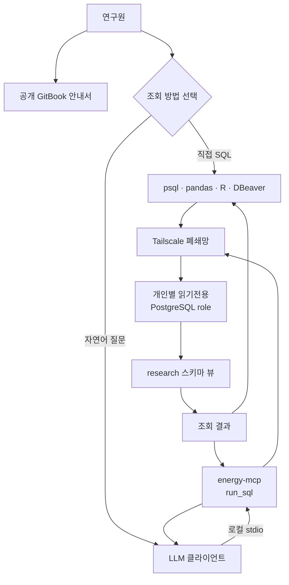

# 연구 데이터 GitBook 안내서 설계

## 목표

약 5명의 연구원이 발전량·SMP·기상·전력수요 데이터를 스스로 이해하고
조회할 수 있도록 공개 GitBook 안내서를 만든다. 처음 방문한 사용자가 1분
안에 아래 두 조회 방식 중 하나를 선택하고, 설치부터 첫 조회까지 문서만으로
진행할 수 있어야 한다.

1. Tailscale 폐쇄망에서 psql·pandas·R 등으로 PostgreSQL을 직접 조회
2. Tailscale 폐쇄망에서 로컬 `energy-mcp`를 거쳐 LLM에 자연어로 질문

GitBook은 사용법을 설명하는 공개 문서다. 실제 데이터 접근은 Tailscale과
연구원별 읽기전용 PostgreSQL role로 보호한다.

## 대상 독자

- SQL 또는 Python/R로 직접 분석하려는 연구원
- SQL에 익숙하지 않아 LLM·MCP로 데이터를 먼저 탐색하려는 연구원
- 연구원 계정과 Tailscale 접근을 발급·회수하는 운영자

운영자는 문서 작성자지만, 운영 서버의 배포·수집기 유지보수 절차는 이번
GitBook의 독자가 필요로 하는 내용이 아니므로 다루지 않는다.

## 현재 상태

`docs/gitbook/`에 다음 초안이 있다.

- `README.md`: 개요와 시작 순서
- `01-data.md`: 데이터 카탈로그와 스키마 사전
- `02-access.md`: Tailscale, 직접 SQL, MCP, 예제 쿼리가 한 페이지에 혼재
- `03-terms.md`: 이용조건·서약서 초안
- `appendix-local-llm.md`: 로컬 LLM 사용법
- `SUMMARY.md`: GitBook 목차

데이터 내용은 충분하지만, 처음 방문한 연구원이 두 조회 방식의 차이와 공통
보안 구조를 한눈에 파악하기 어렵다. 특히 MCP가 Tailscale과 독립된 공개
서비스처럼 오해될 여지가 있다.

## 확정한 설계 결정

| 항목 | 결정 |
|---|---|
| 문서 플랫폼 | GitBook Free 공개 사이트 |
| 작성자 | 관리자 1명 |
| 독자 | 로그인 없이 읽기 |
| 문서 원본 | 이 저장소의 `docs/gitbook/` |
| 배포 | 기본 브랜치와 GitBook Git Sync |
| 저장소 연결 | GitBook의 Project directory를 `docs/gitbook`으로 지정 |
| 편집 원칙 | 저장소 Markdown이 기준본. 웹 편집은 긴급 수정 외 사용하지 않음 |
| 다이어그램 | Mermaid 한 장으로 두 조회 경로와 공통 보안 경계를 설명 |
| GitBook API | 토큰 검증과 전용 Space·Docs Site 생성에 사용. GitHub App 승인은 화면에서 수행 |
| 인증정보 | 실제 호스트·비밀번호·Tailscale 초대 링크는 문서에 넣지 않음 |

GitBook은 GitHub/GitLab 양방향 Git Sync와 모노레포 Project directory를
지원한다. Mermaid는 조직에 연동을 설치하고 해당 Space에 활성화해야
렌더링된다.

- [Git Sync 공식 문서](https://gitbook.com/docs/getting-started/git-sync)
- [모노레포 Project directory 공식 문서](https://gitbook.com/docs/getting-started/git-sync/monorepos)
- [GitBook Markdown 공식 문서](https://gitbook.com/docs/creating-content/formatting/markdown)
- [Mermaid 연동 공식 문서](https://gitbook.com/docs/help-center/integrations/existing-integrations/why-is-the-mermaid-block-not-loading)
- [GitBook API 공식 문서](https://gitbook.com/docs/developers/gitbook-api)

## 정보 구조

최종 문서는 아래 7개 읽기 페이지와 목차 파일로 구성한다.

| 순서 | 파일 | GitBook 표시 제목 | 목적 |
|---:|---|---|---|
| 1 | `README.md` | 한눈에 보기 | 대상 데이터, 공통 준비, 두 방식 선택, 다음 행동 |
| 2 | `01-architecture.md` | 데이터 제공 구조 | 전체 Mermaid, 보호 경계, 요청·응답 흐름 |
| 3 | `02-direct-sql.md` | 직접 SQL로 조회 | Tailscale, 개인 계정, psql·pandas·R, 첫 쿼리, 오류 해결 |
| 4 | `03-llm-mcp.md` | LLM·MCP로 조회 | 로컬 MCP 설치·설정, 질문 예시, 결과 검증, 오류 해결 |
| 5 | `04-data-catalog.md` | 데이터 카탈로그·스키마 | 기존 뷰별 행수·기간·단위·품질·시간 규약 |
| 6 | `05-terms.md` | 이용조건·보안 | 서약, 허용·금지 행위, 감사 로그, 계정 회수 |
| 7 | `appendix-local-llm.md` | 부록: 로컬 LLM | 외부 LLM로 결과를 보내지 않는 선택 경로 |
| - | `SUMMARY.md` | 왼쪽 목차 | 아래 네 그룹으로 페이지 탐색 제공 |

`SUMMARY.md`의 논리적 그룹은 다음과 같다.

```text
시작하기
  ├─ 한눈에 보기
  └─ 데이터 제공 구조
데이터 조회
  ├─ 직접 SQL로 조회
  └─ LLM·MCP로 조회
데이터 이해
  └─ 데이터 카탈로그·스키마
정책과 참고
  ├─ 이용조건·보안
  └─ 부록: 로컬 LLM
```

기존 `01-data.md`, `02-access.md`, `03-terms.md`의 유효한 내용은 버리지
않고 새 구조에 맞게 이동한다. `02-access.md`만 직접 SQL과 LLM·MCP 두
페이지로 분리한다.

## 첫 화면 설계

`README.md`는 아래 순서로 짧게 구성한다.

1. 한 문장 소개: 어떤 데이터를 어떤 목적으로 제공하는지 설명
2. 공개 범위 경고: GitBook은 공개지만 실제 데이터는 보호된다는 점 명시
3. 최초 1회 준비: 서약 → Tailscale → 개인 DB 계정 → 방법 선택
4. 두 방식 비교표
   - 직접 SQL: 정밀 분석·재현 가능한 쿼리에 권장
   - LLM·MCP: 스키마 탐색·간단 조회에 권장
5. 전체 데이터 흐름 Mermaid
6. 데이터 범위 요약과 카탈로그 링크
7. 이용조건 링크

첫 화면에 설치 명령, 긴 스키마 표, 상세 약관을 넣지 않는다. 사용자가 선택한
다음 페이지에서 필요한 정보만 읽게 한다.

## 데이터 흐름

두 방법은 독립된 외부 서비스가 아니다. Tailscale과 개인별 DB role을 공통
보안 기반으로 사용하며, MCP는 연구원 PC에서 실행되는 선택적 변환 계층이다.



문서 본문에서는 다음 보호 장치를 다이어그램 바로 아래에서 설명한다.

- 네트워크: Tailscale 밖에서는 PostgreSQL에 연결할 수 없음
- 권한: 운영 테이블은 숨기고 `research` 스키마 뷰만 `SELECT` 허용
- 식별: 연구원마다 서로 다른 PostgreSQL role 사용
- 감사: 누가 어떤 SQL을 실행했는지 DB 로그에 기록

## 페이지 작성 규칙

- 한국어를 기본으로 하고 처음 나오는 기술어에는 한 줄 설명을 붙인다.
- 페이지 맨 위에서 “누가 언제 읽는 페이지인지”를 한 문장으로 알린다.
- 절차는 번호 목록으로, 선택지는 비교표로, 명령은 코드 블록으로 표현한다.
- 경고는 짧은 GitBook hint 또는 인용문으로 통일한다.
- 한 문단에는 하나의 행동이나 개념만 둔다.
- 실제로 검증한 명령만 제공하며 예상 결과를 바로 아래에 적는다.
- 같은 설명을 여러 페이지에 복사하지 않고 정본 페이지로 링크한다.
- 과도한 이모지, 장식용 이미지, 불필요한 배지와 마케팅 문구는 넣지 않는다.

## 방법 1: 직접 SQL

`02-direct-sql.md`는 사용자가 위에서 아래로 따라 하면 첫 쿼리까지 성공하도록
구성한다.

1. 필요한 것: 서약 완료, Tailscale 초대, 개인 DB 계정
2. Tailscale 설치·로그인·상태 확인
3. pv와 demand DB 접속정보의 플레이스홀더 형식
4. psql로 연결 확인과 `\dv`, `\d+` 사용법
5. pandas와 R 연결 예시
6. 작고 안전한 첫 쿼리
7. 자주 쓰는 검증된 분석 쿼리
8. 오류 해결

대량 조회를 첫 예제로 사용하지 않는다. 기간 조건과 `LIMIT`이 있는 안전한
쿼리부터 시작한다.

## 방법 2: LLM·MCP

`03-llm-mcp.md`는 MCP가 별도 공개 서버가 아니라 연구원 PC의 로컬
프로그램임을 첫 문단에서 명시한다.

1. 요청 흐름: LLM → 로컬 MCP → Tailscale → 개인 role → research 뷰
2. 지원 클라이언트와 사전 준비
3. 저장소 로컬 체크아웃에서 실행하는 현재 설치법
4. `ENERGY_MCP_DSN` 플레이스홀더 설정
5. 클라이언트 설정 예시
6. 좋은 질문과 나쁜 질문 예시
7. 실행 SQL을 확인하고 결과를 검증하는 방법
8. MCP 실패 시 직접 SQL로 전환하는 방법

LLM 답변은 분석의 최종 근거로 취급하지 않는다. 논문·보고서에 사용하는
결과는 실행 SQL, 시간 규약, 단위, 데이터 품질 등급을 연구원이 직접
검증해야 한다.

## 오류 처리와 안내

| 증상 | 문서에서 안내할 원인 | 해결 |
|---|---|---|
| DB 연결 시간 초과 | Tailscale 미연결 또는 잘못된 호스트 | `tailscale status` 확인 후 관리자에게 호스트 재확인 |
| 인증 실패 | 개인 role·비밀번호 오류 또는 회수된 계정 | 실제 비밀번호를 문서에 남기지 말고 관리자에게 재발급 요청 |
| 쿼리 60초 초과 | 조회 기간이 너무 넓음 | 기간 조건, 발전소·지점 조건, `LIMIT` 추가 |
| MCP가 시작되지 않음 | 로컬 경로·환경변수·패키지 설정 오류 | MCP 로그와 `ENERGY_MCP_DSN` 확인 |
| MCP 답변이 이상함 | 생성 SQL 또는 데이터 의미 해석 오류 | 실행 SQL 확인 후 카탈로그의 단위·시간·품질 규칙과 대조 |
| Mermaid가 코드로 보임 | GitBook Mermaid 연동 미설치·미활성 | 조직에 연동 설치 후 해당 Space에 활성화 |
| Git Sync가 비어 있음 | Project directory 설정 오류 | `docs/gitbook` 경로와 기본 브랜치 확인 |

## GitBook 연동

`GITBOOK_API_TOKEN`은 루트 `.env`에 보관하고 Git에 커밋하지 않는다. API는
아래 범위에서만 사용한다.

1. `GET /v1/user`로 토큰 인증 확인
2. `GET /v1/orgs`, `GET /v1/orgs/{organizationId}/spaces`,
   `GET /v1/orgs/{organizationId}/sites`로 기존 항목 확인
3. 정확히 같은 제목의 전용 Space가 없으면 `에너지 연구 데이터 안내` Space 생성
4. 정확히 같은 제목의 전용 Docs Site가 없으면 Free의 `basic`, `public` Site 생성
5. 기존 기본 Space·Site는 삭제하거나 덮어쓰지 않음

각 생성 전에 정확한 제목으로 다시 조회해 중복 생성을 막는다. 무료 플랜의
사이트 수 제한 등으로 생성이 거부되면 기존 사이트를 임의로 바꾸지 않고
중단해 사용자에게 보고한다. 이 작업을 위한 영구 프로비저닝 스크립트는
만들지 않는다.

GitHub 저장소 권한 승인은 API 토큰과 별개이므로 GitBook 화면에서 한 번
설정한다.

1. GitBook GitHub App을 이 저장소에 승인
2. 새 Space의 Git Sync에서 저장소와 기본 브랜치 선택
3. Project directory를 `docs/gitbook`으로 설정
4. 최초 동기화 방향은 GitHub → GitBook 선택
5. Mermaid 연동을 설치하고 Space에 활성화

이후 변경은 저장소에서 Markdown을 수정하고 기본 브랜치에 반영해 배포한다.
GitBook 웹 편집으로 발생한 역방향 커밋과 저장소 수정이 충돌하지 않도록 웹
편집은 긴급 상황 외에는 사용하지 않는다.

GitBook API로 만든 Space와 Site의 ID·게시 URL은 작업 결과로만 보고하고
`.env`나 문서에 저장하지 않는다. Git Sync와 Mermaid는 최초 UI 승인이 필요한
설정으로 남긴다.

## 검증

### 저장소 검증

- `SUMMARY.md`의 모든 링크가 실제 파일을 가리키는지 확인
- Markdown 내부 상대 링크가 새 파일명과 일치하는지 확인
- 실제 비밀번호, 완성된 DSN, Tailnet IP, 초대 링크가 없는지 확인
- `README.md`와 `01-architecture.md`가 두 경로의 공통 Tailscale 기반을
  서로 다르게 설명하지 않는지 확인
- 변경 전 문서의 데이터 수치·품질 경고·시간 규약이 누락되지 않았는지 비교

### GitBook 검증

- 비로그인 시크릿 브라우저에서 모든 공개 페이지 열람
- 기본 브랜치 문서 변경이 GitBook에 자동 반영
- Mermaid가 코드가 아닌 다이어그램으로 표시
- 왼쪽 목차, 이전/다음 이동, 본문 내부 링크 확인
- 데스크톱과 모바일에서 긴 표와 코드 블록의 가독성 확인

### 사용자 시나리오 검증

- 신규 연구원이 GitBook 첫 화면만 보고 두 조회 방식의 차이를 설명할 수 있음
- 직접 SQL 사용자가 Tailscale 연결부터 첫 제한 쿼리까지 완료할 수 있음
- MCP 사용자가 자연어 질문의 실제 SQL을 확인하고 결과를 검증할 수 있음
- 관리자가 계정 회수 순서인 PostgreSQL role → Tailscale 접근을 찾을 수 있음

## 범위 밖

- 공인 인터넷에 공개하는 원격 MCP 서버
- REST API, nginx, Redis, API key 게이트웨이
- GitBook 로그인·SSO·비공개 공유 링크
- 운영 파이프라인 배포·장애 대응 매뉴얼
- 실제 연구원 비밀번호·DSN·호스트·Tailscale 초대 링크 생성 또는 배포
- 기존 GitBook 기본 Space·Site 삭제 또는 덮어쓰기
- GitBook API 영구 프로비저닝 스크립트

이 항목들은 Phase 2 또는 별도 운영 문서에서 다룬다.
